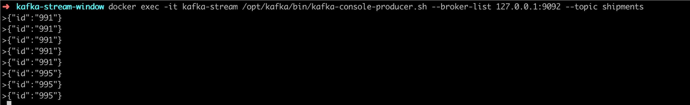
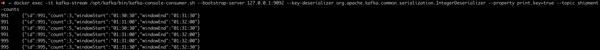

## What is this app?

Spring Cloud Stream Kafka demonstrating the windowing concept: rolling & hopping.

## Running the app:


````bash
docker-compose up -d
````

```bash
./mvnw clean package
```

The below command will track following shipment ID’s 
 1. 991
 2. 992
 3. 993
 4. 994
 5. 996
 
 every 30 seconds with the counts from the last minute. In other words, every 40 seconds a new 1 minute window is started.

````commandline
 java -jar target/kafka-stream-window-0.0.1-SNAPSHOT.jar --app.shipment.tracker.shipmentIds=991,992,993,994,995 --spring.cloud.stream.kafka.streams.timeWindow.length=60000 --spring.cloud.stream.kafka.streams.timeWindow.advanceBy=40000
````

Now launch a Kafka producer & consumer as shown below:

````commandline
docker exec -it kafka-stream /opt/kafka/bin/kafka-console-producer.sh --broker-list 127.0.0.1:9092 --topic shipments
````

````commandline
docker exec -it kafka-stream /opt/kafka/bin/kafka-console-consumer.sh --bootstrap-server 127.0.0.1:9092 --key-deserializer org.apache.kafka.common.serialization.IntegerDeserializer --property print.key=true --topic shipment-counts
````

Now produce the shipments as shown below:



Now observe the consumer windows shown the counts in the TimeWindows:



````
NOTE: In order to switch to a hopping window, use the spring.cloud.stream.kafka.streams.timeWindow.advanceBy (value in milliseconds). This will create an overlapped hopping windows depending on the value provided.
````
